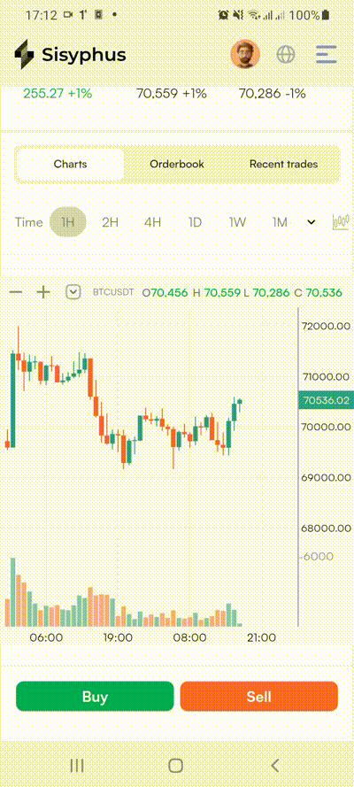
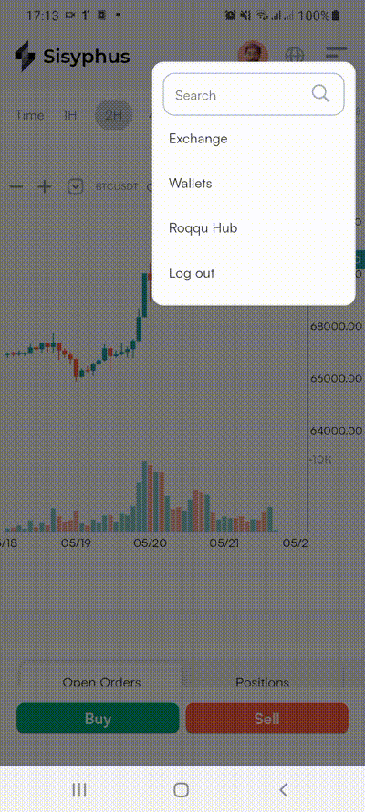

# RavenPay Assessment

## Overview

This project is a Flutter application that leverages various libraries to build a responsive and interactive user interface. The application integrates state management, HTTP communication, WebSocket connections, and SVG rendering to show real-time orders and prices from  Binance API.

## Dependencies

### cupertino_icons
- **Version**: ^1.0.2
- **Description**: Provides iOS style icons for use in Flutter applications.
- **Usage**: Used for incorporating Cupertino (iOS-style) icons in the UI.

### flutter_riverpod
- **Version**: ^2.5.1
- **Description**: A provider solution for managing state in a Flutter application.
- **Usage**: Used for managing state throughout the application efficiently and effectively.

### candlesticks
- **Version**: ^2.1.0
- **Description**: A library for creating candlestick charts in Flutter.
- **Usage**: Used to render financial candlestick charts for data visualization within the app.

### hooks_riverpod
- **Version**: ^2.5.1
- **Description**: A combination of Flutter hooks and Riverpod for enhanced state management capabilities.
- **Usage**: Used to simplify the state management and lifecycle of the widgets, combining the power of hooks and Riverpod.

### flutter_svg
- **Version**: ^2.0.10+1
- **Description**: A library for rendering SVG (Scalable Vector Graphics) in Flutter.
- **Usage**: Used for displaying SVG images in the application, which are scalable and resolution-independent.

### http
- **Version**: ^1.2.1
- **Description**: A package for making HTTP requests.
- **Usage**: Used for performing network operations like GET and POST requests to communicate with APIs.

### web_socket_channel
- **Version**: ^2.4.5
- **Description**: A WebSocket implementation for Dart.
- **Usage**: Used for real-time communication through WebSockets, enabling features like live updates.

### gap
- **Version**: ^3.0.1
- **Description**: A utility for creating consistent gaps (spacers) in Flutter layouts.
- **Usage**: Used for adding space between widgets in a consistent and responsive manner.

### intl
- **Version**: ^0.19.0
- **Description**: A package for internationalization and localization, including formatting dates and numbers.
- **Usage**: Used for handling internationalization, making the app accessible to users from different locales with appropriate date and number formatting.

## Getting Started

To start working on this project, follow these steps:

1. **Clone the repository**:
   ```bash
   git clone <repository-url>
   cd <project-directory>

2. flutter pub get




